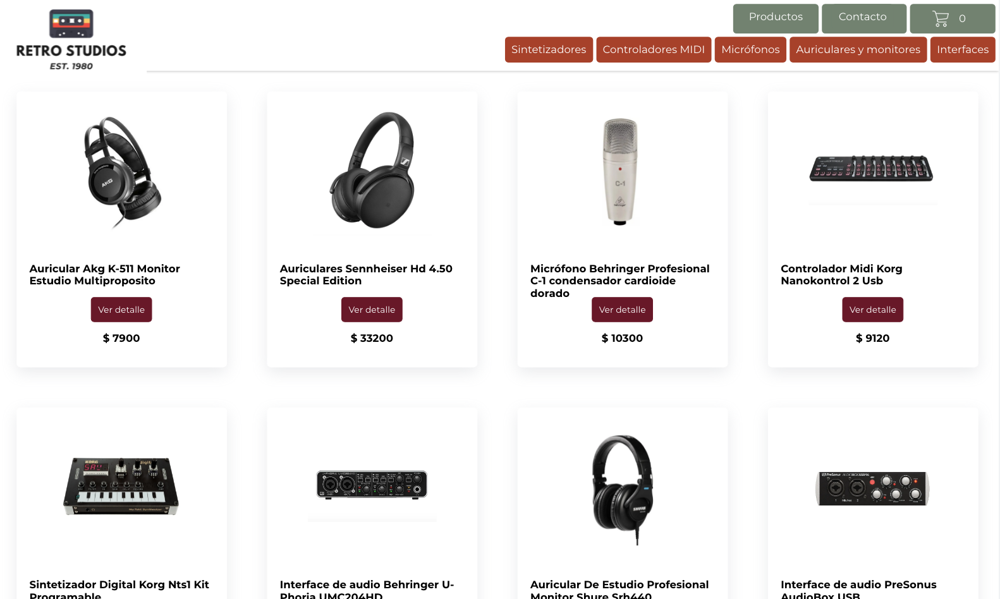

# 🎧 Retro Studios

This project was created as part of a React Js course. It consists of a store through which different music production and recording equipment is sold.

## 🔗 Demo Link

https://retro-studios.surge.sh

## 💻 Installation

First, clone this repository. You will need to install npm to run the project.

Installation:

`npm install`

To Start Server:

`npm start`

To build the app for production to the build folder:

`npm run build`

;